### Netspeedy

Infrastructure engineering, automation, networking and platform operations built from real systems.

[`kubertech.io`](https://kubertech.io) | [`kubertech.dev`](https://kubertech.dev) | [`oakes.me.uk`](https://oakes.me.uk) | [`github.com/soakes`](https://github.com/soakes)

## What Netspeedy Is

Netspeedy is a long-running infrastructure engineering environment covering Linux systems, automation, Kubernetes, GitOps, DNS, certificates, networking, storage, CI/CD, self-hosted services and operational tooling.

The point is practical engineering, not isolated demo content. The work behind Netspeedy is built around the same habits expected in production environments: clear ownership, repeatable change, source-controlled intent, careful automation, observable behaviour and recovery paths that are understood before they are needed.

This public profile focuses on the engineering approach, selected public work and platform story that represent Netspeedy externally.

## Operational Signals

| Signal | Public value |
| --- | --- |
| 25+ years operating production infrastructure | Experience across ISP, media, build, cloud, virtualisation, networking, storage and CI/CD environments. |
| 2,500+ VM estates automated with Ansible | Large-scale automation, standardisation and drift reduction in real production environments. |
| 300+ DNS zones managed in production roles | DNS, routing, certificates and edge behaviour treated as operationally critical platform work. |
| Public tools and publishing pipelines | Go, Python, GitHub Actions, Cloudflare Pages and operator-focused automation used for practical outcomes. |

## Engineering Focus

| Area | What it means |
| --- | --- |
| Infrastructure as code | Hosts, services, routing, runners and platform components managed through reviewable desired state instead of hand-maintained snowflakes. |
| Kubernetes and GitOps | K3s, Argo CD, application boundaries, platform services and environment overlays used where orchestration makes sense. |
| Automation and operations | Ansible, GitHub Actions, scripts, CLIs and repeatable workflows used to remove fragile manual steps. |
| Networking and edge | DNS, routing, VPNs, certificates, ingress and public exposure treated as first-class platform concerns. |
| Service ownership | Self-hosted and platform services operated with maintainability, upgrades, backups and failure handling in mind. |
| Recovery discipline | Backup, rollback, unseal, restore and maintenance paths treated as part of the design rather than incident-time improvisation. |

## Public References

| Link | Role |
| --- | --- |
| [`kubertech.io`](https://kubertech.io) | Production public view of the Kubernetes and GitOps platform slice. |
| [`kubertech.dev`](https://kubertech.dev) | Development-side view for platform changes, validation and promotion flow. |
| [`oakes.me.uk`](https://oakes.me.uk) | Public CV and professional profile for Simon Oakes. |
| [`github.com/soakes`](https://github.com/soakes) | Public engineering work, tools and automation projects. |

## Selected Public Work

| Project | Stack | Why it matters |
| --- | --- | --- |
| [`blackhole-threats`](https://github.com/soakes/blackhole-threats) | Go / GoBGP / Linux | Network defence automation using controlled BGP blackhole signalling from threat feeds. |
| [`s3ctl`](https://github.com/netspeedy/s3ctl) | Go / S3 / IAM | Operator-focused S3 tooling for bucket provisioning, scoped credentials and batch operations. |
| [`homebrew-s3ctl`](https://github.com/netspeedy/homebrew-s3ctl) | Ruby / Homebrew | Homebrew tap for installing `s3ctl` on macOS and Linux. |
| [`s3mirror`](https://github.com/soakes/s3mirror) | Python / S3 | Object storage mirroring with parallel transfer, structured logging and disaster-recovery workflows. |
| [`zquota`](https://github.com/netspeedy/zquota) | Python / CLI / Z.ai | Small terminal CLI for Z.ai quota usage and exact reset windows. |
| [`homebrew-zquota`](https://github.com/netspeedy/homebrew-zquota) | Ruby / Homebrew | Homebrew tap for installing `zquota` on macOS and Linux. |

## How We Work

Good infrastructure work is not just about deploying things. It is about making change understandable, repeatable and safe enough that future maintenance is not a gamble.

| Principle | Practice |
| --- | --- |
| Source of truth first | Make the intended state clear in Git before changing live systems. |
| Automate the repeatable | If a task will happen again, it should become a script, role, workflow or documented path. |
| Keep changes reviewable | Prefer narrow diffs, clear ownership and small blast radius over broad operational churn. |
| Design for recovery | Backups, rollback, restore and failure modes need attention before production pressure arrives. |
| Document the surprising | The obvious parts can stay simple. The sharp edges should be written down. |
| Communicate clearly | Explain the operating model in public terms, focusing on principles, outcomes and maintainable engineering. |

## KuberTech

KuberTech is the Kubernetes and GitOps platform part of Netspeedy.

It shows how Kubernetes workloads, platform services, GitOps workflows, environment separation and promotion paths are handled. It does not represent the whole of Netspeedy; it is one part of a wider infrastructure and automation environment.

Start here if you specifically want the Kubernetes platform view:

| Site | Purpose |
| --- | --- |
| [`kubertech.io`](https://kubertech.io) | Production public platform view. |
| [`kubertech.dev`](https://kubertech.dev) | Development and validation platform view. |

## Background

Netspeedy is maintained by Simon Oakes, a UK-based Senior Linux, DevOps and Platform Engineer with 25+ years of experience across ISP infrastructure, media platforms, CI/CD systems, virtualisation, networking, storage, automation and production operations.

The public CV and professional profile are available at [`oakes.me.uk`](https://oakes.me.uk).

---

**Infrastructure should be boring for the right reasons: clear state, controlled change and recovery paths that work.**

